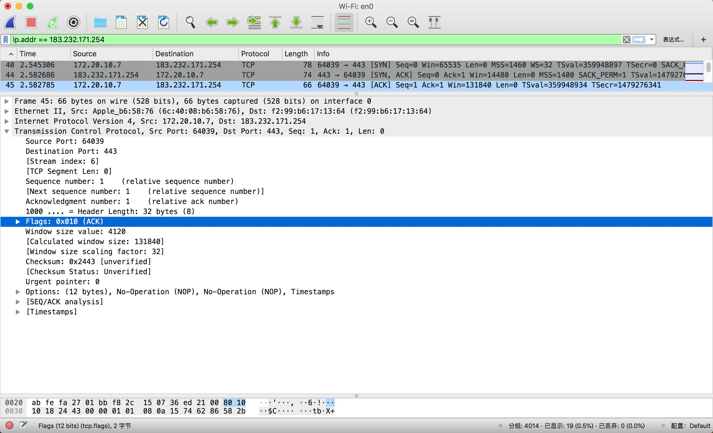

# 2020

> 2020 年常见的前端 topic

<details open block>
<summary>折叠/展开目录</summary>

[[toc]]

</details>

## html

### 把带 css 链接的 link 标签放在 head 标签内，而带 js 链接的 script 标签尽量靠近 body, 为什么会有这种提议？如果必须不这样做，该如何处理？

HTML 解析是自上向下解析的。若在 `<head>` 中解析到 `<link>` 标签的话，可以一边加载样式表渲染样式，一边继续向下解析。

若解析到 `<script>` 标签的话，由于 `<script>` 有可能会修改 DOM 的结构(比如 `document.write()`)，因此会停止渲染，先将 `<script>` 加载完毕并执行后，才继续向下解析。在这阻塞的过程中，用户所看到的页面将是一片空白，会影响用户体验。所以早期最佳实践就是将 `<script>` 放到 `</body>` 之前，这样就不会影响页面的渲染了。

HTML5 为 `<script>` 引入了 `async` 属性，添加该属性后可使脚本请求并行加载，让尽快解析和执行而不阻塞渲染。常见的应用场景就是没有 `DOM` 依赖关系或是没有跟其他脚本有依赖关系的脚本，如页面统计等。

## css

### 列举水平垂直居中的实现

[CSS 居中元素实现示例](../css/README.md##layout-%e5%b1%85%e4%b8%ad%e5%85%83%e7%b4%a0)

### 计算样式权重

已知设备 IPhone6, 写出 div 最后的 color、font-size 值:

``` html
<style>
  div { font-size: 1rem; color: blue; }
  .class1 { font-size: .32rem; color: red; }
  #id1 { color: #333; }
  #id1 div { color: #666; }
  .class1 div { color: #999; }
  .class1 .class2 div { color: #aaa; }
</style>

<div class="class1">
    <div id="id1" class="class2">
        <div>文字</div>
    </div>
</div>
```

**答:** 从 DOM 的结构来看共有三层，各层实际被应用的样式为:

- 第一层: `font-size: .32rem`, `color: red`
- 第二层: `font-size: 1rem`, `color: #333`
- 第三层(含文字那层): `font-size: 1rem`, `color: #666`

CSS 选择器优先级:

| 优先级 | 权重   | 类型                                                                                      |
| ------ | ------ | ----------------------------------------------------------------------------------------- |
| 0 级   | 0      | 通配符(`*`)、选择符(`+`、`>`、`~`、`||`、空格等)、逻辑组合伪类(`:not`、`:is()`、`:where`) |
| 1 级   | 1      | 标签选择器，如 `body {...}` 等                                                            |
| 2 级   | 10     | 类选择器(`.list {...}`)、属性选择器(`body] {...}`)、伪类(`:hover`)                        |
| 3 级   | 100    | ID选择器(`#title {...}`)                                                                  |
| 4 级   | 内联级 | `style` 属性内联: `<span style=" color: red;" />`                                         |
| 5 级   | 顶级   | 添加 `!important` 规则： `.title { color: red !important; }`                              |

样式覆盖规则:

- 相同权重的样式，应用最后声明的样式
- 多个选择器则叠加权重，如: `.list > .item {...}` 的权重为 `10 + 0 + 10 = 20`。
- `style` 内联样式默认覆盖外部样式表的样式。除非内联样式设置了普通样式，而外部样式表的样式使用了 `!important` 规则的情况就无法覆盖。但也可以在 `style` 设置的样式属性中加上 `!important` 规则，叠加后权重就更高了(一般不推荐使用 `!important`)

## 综合

### 什么是纯函数

纯函数由三大原则构成：

1. 给定相同输入，它总是返回相同的输出
2. 过程没有副作用(side effect)
3. 没有额外的状态依赖

### 谈谈对 MVVM 的理解 <Badge text="TODO" type="warning"/>

TODO: 待补充...

### 说说从浏览器地址栏输入 URL 到页面加载完的过程中都发生了什么事情?

[从浏览器地址栏输入 URL 到页面渲染之间都经历了什么](https://zhuanlan.zhihu.com/p/95904514)

## 优化类

### SPA（vue/react） 如何优化首页的加载速度？首屏空白是什么问题引起的？ <Badge text="TODO" type="warning"/>

最佳解决方案是使用服务端渲染来解决首屏空白的问题。

首屏空白主要出现在单页面应用 (SPA) 上，SPA 本质上是将页面的逻辑都存入了 js 中。浏览器会先加载 HTML 文档，再通过 HTML 文档下载包含页面逻辑的 js 文件，下载后还得执行 js 代码，再将页面渲染出来。

TODO: 待补充...

### 页面性能优化有哪些方案？

1. **尽可能减少 HTTP 请求**：CSS spirit 合并图片，小文件转为 Base64，合并 css/javascript 文件。
2. **使用 CDN**：CDN就是内容分发网络, 简单地说就是用户可以从最优的节点获取速度，从而达到快速访问，并减少源站负载压力的目的。
3. **减少 DNS 请求**
4. **文件/模块复用**
5. **按需加载**
6. **虚拟化长列表**: 过长的列表(成百上千条数据)会造成页面渲染压力大，因此可以使用 “虚拟滚动技术”。它可以在有限的事件内进渲染有限的内容，从而降低重新渲染组件所耗费的事件，以及创建 DOM 节点的数量。

## 解决方案

### 列举移动端适配方案

1. `rem`
2. `vw`/`vh`
3. 响应式 (`media query` 等)

### 怎么处理跨域？

- 前端开发时可使用 webpack devserve 进行代理
- jsonp
- nginx

## HTTP

### 列举 HTTP 状态码以及它们的含义

下面列举 web 开发中常见的 HTTP code:

- 200 (ok): 请求成功
- 204 (No Content): 请求成功，不需要附带实体内容 (body)
- 301 (Moved Permanently): 永久重定向。被请求的资源已永久移动到新位置
- 302 (Found): 临时重定向。请求的资源临时从不同的 URI 响应请求。由于这样的重定向是临时的，客户端应当继续向原有地址发送以后的请求。
- 400 (Bad Request): 请求参数有误
- 401 (Unauthorized): 当前请求需要用户验证
- 403 (Forbidden): 没有权限的操作。服务器已经理解请求，但拒绝执行。
- 404 (Not Found): 资源没有找到
- 500 (Internal Server Error): 服务端出现了错误
- 502 (Bad Gateway): 网关错误。此错误响应表明服务器作为网关需要得到一个处理这个请求的响应，但是得到一个错误的响应
- 503 (Service Unavailable): 服务器停止服务。常见原因是服务器因维护或重载而停机
- 504 (Gateway Timeout): 网关超时。当服务器作为网关，不能及时得到响应时返回此错误代码。

### HTTP 的 GET 和 POST 请求有什么区别？

GET 和 POST 在浏览器上的表现会根据使用场景有各自的优缺点:

- GET 可以直接在浏览器上手动输入请求，在浏览器地址直接请求的 URL 在非匿名模式下会被浏览器记录下来的。这样用户可以通过历史记录来找回之前访问过的页面。反之，POST 不会在浏览器留下痕迹。
- GET 在浏览器地址上的长度是有限制的，POST 没有限制。
- GET 的请求一般可以被浏览器缓存
- 带云压缩的浏览器，比如 Opera mini/Turbo 2, 只有 GET 才能在服务器端被预取

但实际使用时 GET 和 POST 请求所进行的操作取决于服务端是如何解释的。比如一种极端情况就是：不管你是查询、删除、更新还是提交数据也好，所有请求一律使用 POST 来实现都没问题。但这种做法不符合主流的 `RESTful APIs` 设计规范，不建议这样做。

相关讨论参见: [post 相比get 有很多优点，为什么现在的HTTP通信中大多数请求还是使用get？](https://www.zhihu.com/question/31640769?rf=37401322)

### TCP 握手过程

1. 浏览器发送 TCP 分组，这个分组设置了一个特殊的 `SYN` 标记，用来表示这是一条连接请求。
2. 服务器接受到客户端的 `SYN` 连接后, 会选择服务器初始序号 `y`。同时向客户端发送含有连接确认 (`SYN + ACK`)、`Seq=0` (本例中的服务器初始序号)、`ACK=1` (客户端的序号 x + 1) 等信息的 TCP 分组。
3. 客户端收到了服务器的确定字段后，向服务器发送带有 `ACK=1`、`Seq=1`、`Ack=1` (服务器 Ack 信息的拷贝)等字段的 TCP 分组给服务器。
4. 服务器接收到客户端的确认字段后完成三次握手的连接，开始给客户端传输它想要资源

   

   <details block>
   <summary>点击显示真实案例</summary>

   以下序号 `40`、`44`、`45` 为 TCP 三次握手的具体数据信息。在右侧的 `info` 栏中显示了分组的标志位信息:

   

   </details>

### 有了解过 HTTP 缓存吗？ <Badge text="TODO" type="warning"/>

主要是指强缓存与协商缓存。

TODO: 待补充区别...

## 运维相关

1. **Q**: 了解过 docker 吗？
2. **Q**: 你们项目的 CI/CD 是怎么搭建的？
3. **Q**: 阿里云的 CDN 资源有缓存，如何强制更新缓存?  
   **A**: 阿里云 CDN 中有一个 Tab 叫**刷新预热**, 在该选项中可以强制刷新缓存。更新缓存的方式有 **URL 刷新**、**目录刷新**以及 **URL 预热**。
4. **Q**: git 除了 `pull`、`push` 外还了解哪些命令？  
   **A**: 可以参考 [Git 速查笔记](../git/README.md) 来回答

## 其他

1. 你哪些项目实现的比较满意？
2. 你碰到最难的一个问题是什么？
3. 是否写过测试用例
4. 是否了解敏捷开发
